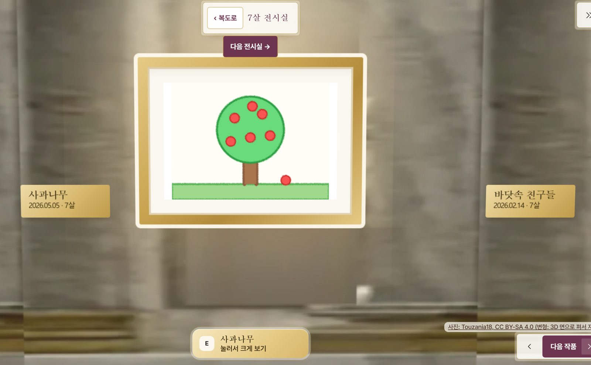

# 우리 아이 미술관

> 작은 손이 남긴 선이, 우리 가족의 한 장면으로.

아이의 작품과 그날의 말을 가족이 함께 간직하고, 시간이 흐른 뒤에도 다시 만나는 기록으로 잇는 가족용 미술관입니다.
보호자가 휴대폰으로 찍은 아이 그림 한 장을 올리면, 그림은 제목 · 그린 날 · 그때 나이가 적힌 명패와 함께 아이의 미술관 벽에 걸립니다.
가족은 나이별 전시실을 함께 걸으며 아이가 자라 온 시간을 다시 꺼내 봅니다.

**기술은 기억을 꾸며내는 주체가 아니라, 다시 꺼내 보는 수단입니다.**



## 누구에게 무엇을 주나

| 누구 | 무엇을 |
|---|---|
| 지금의 아이 | 자기 그림이 미술관에 걸리고, 원하면 움직이거나 도톰한 입체로 떠오르는 모습을 보호자와 함께 본다. 원본의 선과 색은 그대로 알아볼 수 있다 |
| 지금의 보호자 | 사진 한 장만 올리면 작품만 오려 내 전시하고, 어울리는 감상 방식을 제안받는다. 고르는 것은 보호자다 |
| 성장한 아이 | 자기 작품과 그날의 말로 어린 시절을 돌아본다. 장기 보존이 필요한 후속 가치이며 아직 보장한 것이 아니다 |

## 지키는 원칙

- 작품과 아이의 실제 말이 먼저 보인다. 움직임 · 입체는 보호자가 고를 때만 만든다.
- 원본을 덮어쓰지 않는다. 원본 액자도 완성된 작품으로 대한다.
- AI는 제안까지만 한다. 점수를 보여 주지 않고, 제안과 다른 선택을 막지 않는다.
- 없었던 일 · 감정 · 발달 평가를 만들지 않는다. 그림 점수나 아이 비교 기능을 만들지 않는다.
- 실명 대신 별칭과 그린 때의 나이만 받는다. 아이 그림을 외부 AI 서비스로 보내지 않고 팀 서버 안에서만 처리한다.

## 지금 상태

- 과정 서버에서 견본 미술관을 걷고, 작품을 크게 보며 해설을 듣는 흐름이 동작한다(2026-10-01).
- 모델은 새로 학습하지 않고 공개 사전학습 모델(그림 오려내기 · 종류 제안 · 움직이는 그림 · 깊이)을 이어 붙였다.
- 실제 가족의 사용 · 만족 · 수요는 아직 검증하지 않았다.

원본은 MLOps 과정의 팀 프로젝트(비공개)입니다.

## 내가 맡은 일

| 구분 | 내용 |
|---|---|
| 맡은 일(팀 역할 분담 기준) | API 서버, 작업 DB와 큐, 결과를 만드는 단계의 처리 규칙(낮춤 · 재시도 · 원인 분류), 작품 삭제, 운영 지표 |
| 팀이 함께 정한 것 | 아래 규칙. 팀 결정 기록과 설계서에서 확정했다 |
| 다른 팀원이 맡은 것 | 모델 어댑터와 워커, 모델 평가, 보호자 화면 |

## 이 저장소에 담은 것

팀 코드의 사본이 아니라, 맡은 일의 핵심 규칙을 공개 가능한 최소 코드와 검사로 다시 쓴 것입니다.

| 보호자가 겪을 일 | 규칙 | 결정 기록 |
|---|---|---|
| 움직이는 그림은 한 장에 수십 초에서 몇 분이 걸린다 | 올리는 즉시 원본 액자로 건다. 새 결과는 보호자가 확인해야 바꿔 건다 | [001](docs/decisions/001-original-first.md) |
| 그림에 따라 움직임이 잘 안 나온다 | 품질이 모자라면 한 단계 낮춘다(움직임 → 입체 → 원본 액자). 서버 장애는 같은 단계를 최대 3번 다시 한다 | [002](docs/decisions/002-downgrade-vs-retry.md) |
| 왜 이 결과가 걸렸는지 알아야 고칠 수 있다 | 보호자 선택 · 모델 낮춤 · 보호자 전환 · 인프라 실패 · 결과 미도달을 섞지 않고 기록한다 | [003](docs/decisions/003-five-causes.md) |

```bash
git clone https://github.com/wpalswpa/kids-art-museum-serving-evidence.git
cd kids-art-museum-serving-evidence
python -m unittest discover -s tests -v
```

Python 3.10 이상, 표준 라이브러리만 씁니다. 규칙 코드는 [fallback.py](fallback.py), 검사는 [tests/test_fallback.py](tests/test_fallback.py), 원본 프로젝트에서 실제로 돌려 본 기록은 [evidence/README.md](evidence/README.md)에 있습니다.

## 이 저장소가 보장하지 않는 것

- 검사는 처리 규칙만 확인합니다. 모델이 좋은 결과를 만드는지는 확인하지 않습니다.
- 원본 프로젝트에서 움직이는 그림은 팀이 만든 단순한 그림에서도 크게 일그러졌고, 품질 평가는 그림 수가 적어 끝나지 않았습니다([기록](evidence/README.md)).
- 실제 가족이 쓰는 모습과 만족은 관찰하지 않았습니다.

화면의 회랑 배경은 Touzania18의 사진(CC BY-SA 4.0)을 3D 면으로 펴서 자른 것이고, 견본 그림은 팀이 그렸습니다.
